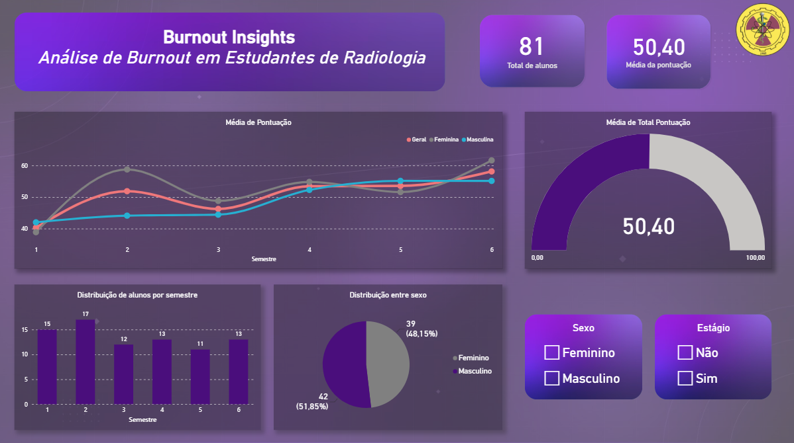

Burnout Insights
Análise interativa de Burnout em estudantes de Tecnologia em Radiologia

Dashboard desenvolvido em Power BI a partir dos dados de uma pesquisa científica publicada sobre a Síndrome de Burnout em estudantes de graduação de Tecnologia em Radiologia.

📊 Sobre o projeto

O Burnout Insights transforma os dados de uma pesquisa científica em uma ferramenta interativa de análise e visualização, permitindo explorar diferentes características da amostra e sua relação com a pontuação de Burnout.

O projeto representa uma aplicação prática de Business Intelligence e Análise de Dados a partir de uma pesquisa previamente realizada e publicada.

🎯 Objetivo

Explorar os dados da pesquisa e visualizar a distribuição da pontuação de Burnout segundo diferentes características dos participantes:

Semestre acadêmico;
Sexo;
Experiência de estágio;
Pontuação de Burnout.
🛠️ Tecnologias
Power BI
DAX
Data Analysis
Data Visualization
📈 Análises apresentadas

O dashboard permite explorar:

Número de participantes;
Pontuação média de Burnout;
Distribuição dos participantes por sexo;
Pontuação de Burnout por semestre;
Comparação entre estudantes em estágio e estudantes apenas em aulas;
Filtros interativos para exploração dos dados.
🔬 Contexto científico

O dashboard foi desenvolvido a partir dos dados de uma pesquisa científica publicada em 2022:

Avaliação da Síndrome de Burnout em discentes de graduação de Tecnologia em Radiologia de uma faculdade de São Paulo.

A pesquisa avaliou a presença de sinais relacionados à Síndrome de Burnout em estudantes de graduação de Tecnologia em Radiologia.

O Power BI foi utilizado neste projeto como ferramenta de exploração, análise e visualização interativa dos dados.

🔎 Principais insights

- A pontuação média geral observada na pesquisa foi de 50,41 pontos.
- As maiores médias foram observadas nos semestres mais avançados.
- Estudantes em estágio apresentaram médias superiores aos estudantes que estavam apenas em aulas.

📚 Referência

Avaliação da Síndrome de Burnout em discentes de graduação de Tecnologia em Radiologia de uma faculdade de São Paulo.

Publicado em 2022.

📄 [Acessar artigo científico](./artigo-burnout-radiologia.pdf)

💡 Aprendizados

Este projeto permitiu aplicar conceitos de:

- Modelagem e tratamento de dados;
- Criação de medidas DAX;
- Construção de indicadores;
- Visualização de dados;
- Análise exploratória;
- Comunicação de resultados.

## 📁 Arquivos do projeto

- 📊 [Dashboard Power BI](./Burnout-Insights.pbix)
- 🖼️ [Imagem do dashboard](./dashboard.png)
- 📚 [Artigo científico](./artigo-burnout-radiologia.pdf)

👤 Autor

Gustavo Evangelista

Projeto desenvolvido como parte da construção de portfólio na área de Data Analytics e Ciência de Dados, conectando experiência em pesquisa na área de Radiologia com análise e visualização de dados.
